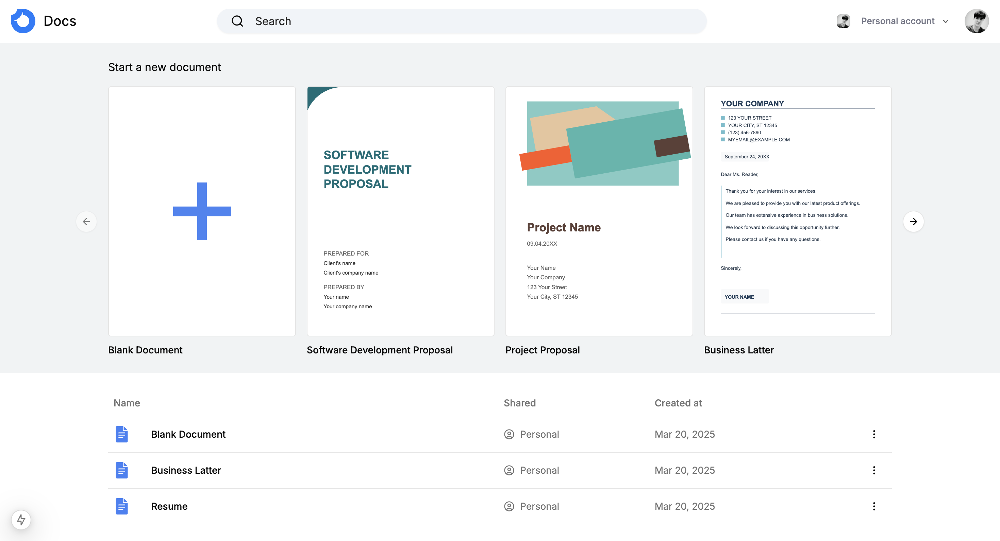
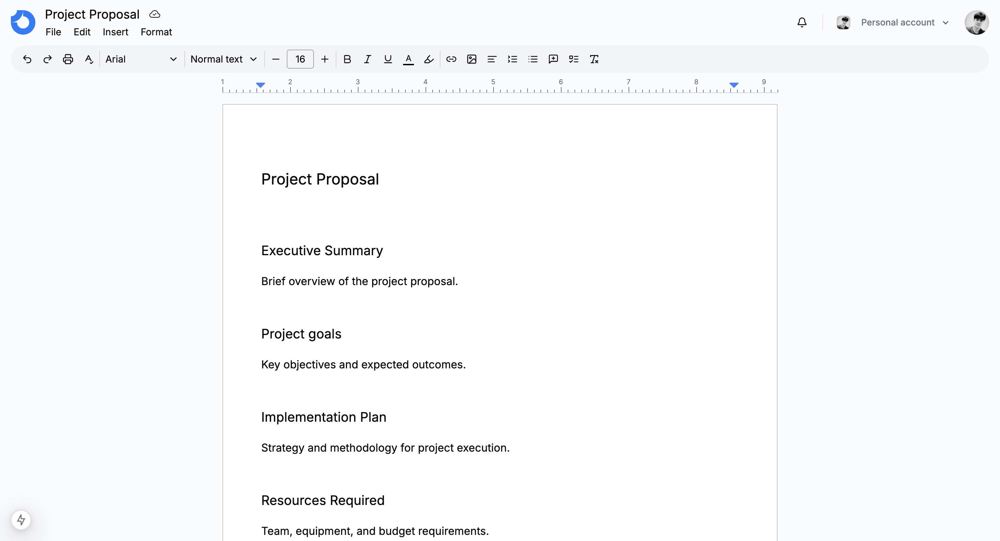

   <h1>Real-Time Google Docs Clone</h1>
   

   

      
       
   

## 📋 <a name="table">Table of Contents</a>

1. 🤖 [Introduction](#introduction)
2. ⚙️ [Tech Stack](#tech-stack)
3. 🔋 [Features](#features)

## <a name="introduction">🤖 Introduction</a>

Hello everyone 👋 This project is a full-stack Google Docs clone, including real-time collaboration, comments, themes, an advanced TipTap editor, custom extensions, templates, and more.

## <a name="tech-stack">⚙️ Tech Stack</a>

- NextJS 15
- React 19
- TypeScript
- Tip Tap Editor
- Convex DB
- Livebloks Collaborative system
- Clerk Authentication system
- Tailwind CSS

## <a name="features">🔋 Features</a>

- 📝 Rich Text Editor
- 🤝 Real-time Collaboration & Database
- 💭 Comments and Mentions
- 📑 Document Templates
- 📋 Copy and Paste Formatting
- ↩ Undo/Redo History
- 📊 Table Support
- 🖼️ Image Uploads
- 📏 Margin Controls
- ⬇️ Export (PDF, HTML, TXT, JSON)
- 👥 User Profiles
- 🏢 Organization Workspaces
- ✉️ Organization Invites
- 🔒 Authentication
- 📱 Responsive Design
- 🎯 Cursor Tracking
- 🎨 Text Formatting Tools
- 📝 Lists and Checklists
- 🔗 Link Embedding
- ⚛️ Framework Next.js 15
- 🎨 Shadcn UI & Tailwind CSS
- 🚀 Deployment on Vercel
